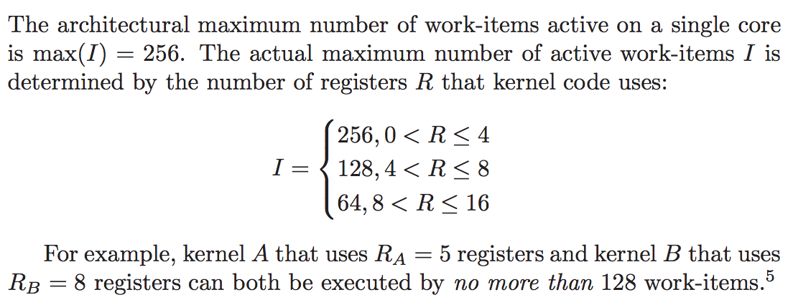

# Optimizing GEneral Matrix-to-Matrix Multiplication (GEMM) Performance on Android

## Test Device

We tested on `Samsung Galaxy S6`, which has a `Mali-T760` GPU.

```
Platform: ARM Platform
  Device: Mali-T760
    OpenCL Driver version  : 1.1 (Android)
    Compute units   : 8
    Clock frequency : 772 MHz
    workgroup sizes : 256
```

The current configuration is set to link with [libOpenCL.so](opencl/libOpenCL.so) from this device. 

## Constraints

One important thing to notice is the following constraints [1].



## Performance

| Size        | CL Kernel           | Throughput (GFlops) |
| ------------- |:-------------:| -----:|
| 1024 x 1024   | [noblock-v8](gemm-noblock-vload8.cl) | 11.14 |
| 1024 x 1024 | [blocking-2x2-v4](gemm-blocking-2x2-vload4.cl)  |  17.4 
| 2048 x 2048     | [noblock-v8](gemm-noblock-vload8.cl)      |  15.45 |
| 2048 x 2048 | [blocking-2x2-v4](gemm-blocking-2x2-vload4.cl)     |  27.3 |
| 4096 x 4096 | [noblock-v8](gemm-noblock-vload8.cl)  |   15.6  |
| 4096 x 4096 | [blocking-2x2-v4](gemm-blocking-2x2-vload4.cl)  |  4.4  |

# GEMM Zoo

Available implementations in literature for reference. None of these achieve good performance on our Android test device.

* [Some GEMM implementation in clBLAS] (https://github.com/clMathLibraries/clBLAS/blob/master/src/library/blas/gens/clTemplates/sgemm_gcn_SmallMatrices.cl)
* [NVidia Implementation Sample] (http://www.nvidia.com/content/cudazone/CUDABrowser/downloads/papers/NVIDIA_OpenCL_BestPracticesGuide.pdf)
* [Intel GEMM Sample] (https://software.intel.com/sites/products/vcsource/files/GEMM.pdf)
* [ViennalCL] (https://www.researchgate.net/publication/229430755_ViennaCL_-_A_High_Level_Linear_Algebra_Library_for_GPUs_and_Multi-Core_CPUs)

# Useful Links

1. [Optimizing OpenCL Kernels for Mali-T600 GPUs](http://malideveloper.arm.com/downloads/GPU_Pro_5/GronqvistLokhmotov_white_paper.pdf)

